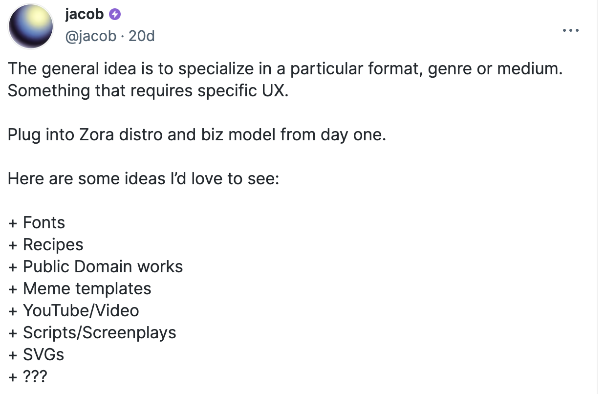

# Zora Onchain Summer 2024 Hackathon Guide

[Zora](https://zora.co) is sponsoring in the Creator Track of the [Onchain Summer Buildathon](https://onchain-summer.devfolio.co/overview)

Zora’s mission is to make creating on the internet free and valuable by building products for people to be more supported and valued for their creativity. As the Creator track sponsor, we are looking for projects that help users Create, Collect, and Curate using the Zora Protocol. Projects are judged based on innovation, usefulness, UX, and technical quality, and must be built on the Zora Protocol.

We are looking for:

- Front-end clients for creation, collection, and curation (or discovery) of Zora mints.
- Ideas that may specialize in particular formats, genres, or mediums and require specific UX.
- New ways to plug into and expand Zora’s business model and protocol rewards.

For any questions, support or discussion, please [post an issue in this repo here](https://github.com/ourzora/zora-ocs-hackathon-24/issues) - the Zora team will be regularly checking these issues and responding to them.

## Resources

- About Zora: [zora.co/about](https://zora.co/about)
- Zora Developer Docs: [docs.zora.co](https://docs.zora.co/)
- Zora Developer Tools Docs: [ourzora.github.io/zora-protocol](https://ourzora.github.io/zora-protocol)
- Zora Protocol Github: [github.com/ourzora/zora-protocol](https://github.com/ourzora/zora-protocol)

## Zora Creator Track Bounties

**Grand prize (1) winner - 6 ETH** our favorite project

3 eth to one winner in each of theses tracks:

- **Create - 3 eth** New tools/products/mediums that serve creators; new forms of media (scripts/screenplays, fonts, recipes), incentivization models, user interfaces, collaboration mechanisms, onboarding flows, Meme templates, multichain tokens
- **Collect - 3 eth** New ways to collect; minting user interfaces, minting mechanisms, pricing models, cross-chain collecting
- **Curate - 3 eth** New ways to display, curate, and discover mints on the Zora Protocol.
- **Imagine - 3 eth** Weird, crazy, wild ideas we didn’t imagine were possible.

**Honorable Mention - 2 ETH divided equally** among projects we like that didn’t make it to the top prizes. All must be built on top of the Zora contracts or developer tools.

To qualify for any bounty, you must build your project on the Zora Protocol. This includes our contracts, developer tools, and subgraph.

### Ideas

